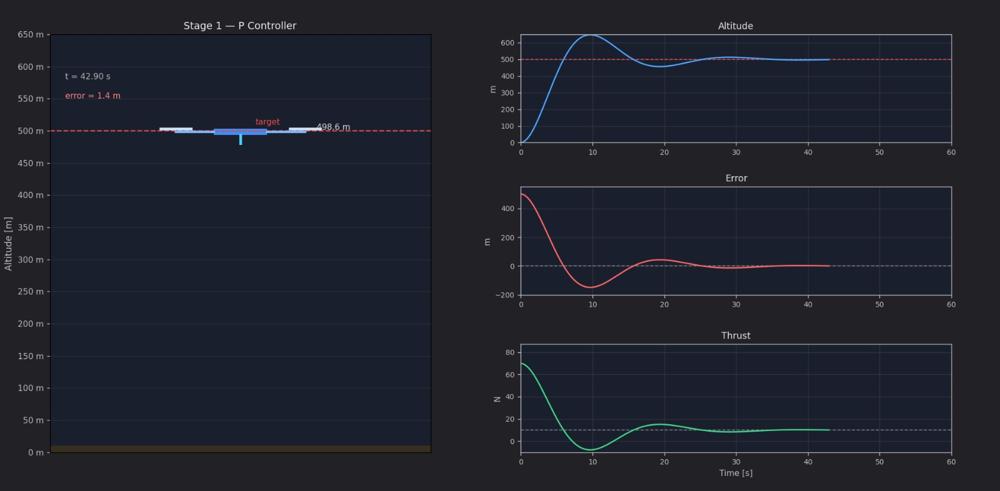
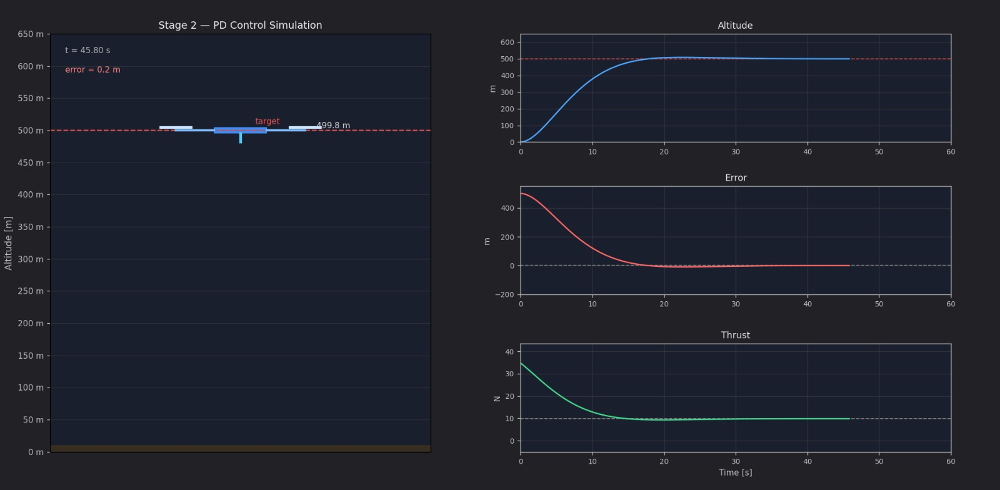
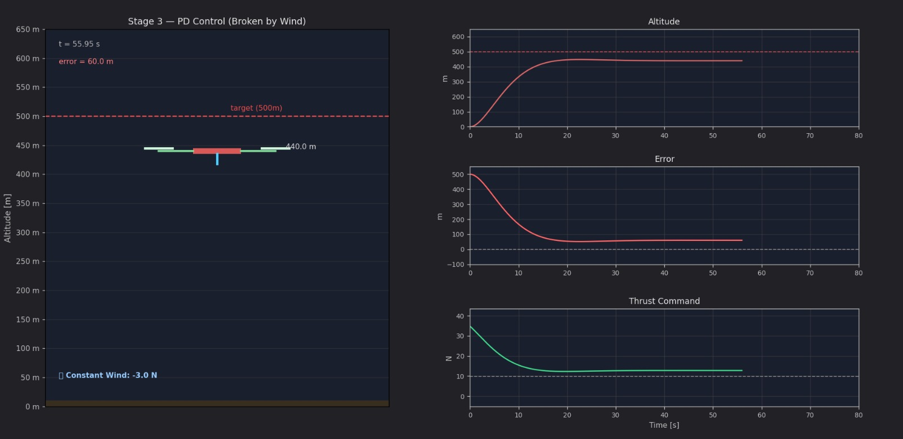
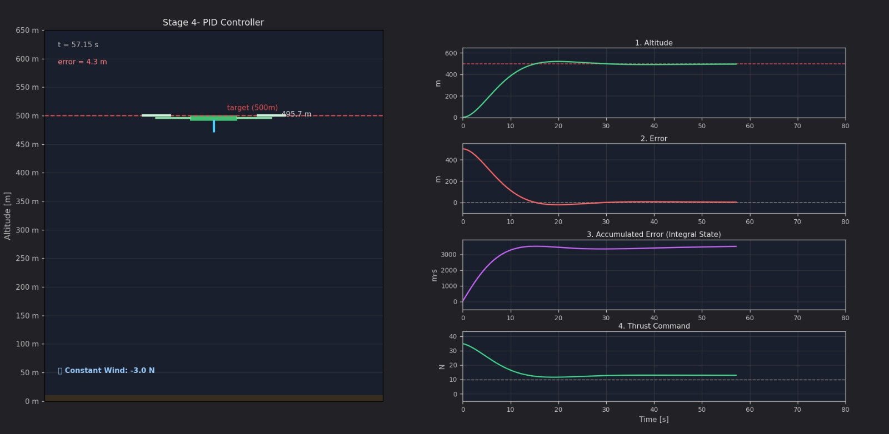

# 🚁 1D Drone PID Control Simulation

> A visual, step-by-step Python simulation that builds a PID controller from scratch — starting with just proportional control, diagnosing each failure, and upgrading the architecture until a drone holds 500 m altitude against a constant headwind.

[](https://www.python.org/)
[](https://hub.docker.com/r/morshedasif/1d_drone_pid_control_sim)
[](LICENSE)
[](https://matplotlib.org/)

---

## Table of Contents

- [What This Project Is](#what-this-project-is)
- [Physics Model](#physics-model)
- [Control Theory — Building Up Stage by Stage](#control-theory--building-up-stage-by-stage)
  - [Stage 1 — P Controller](#stage-1--p-controller)
  - [Stage 2 — PD Controller](#stage-2--pd-controller)
  - [Stage 3 — PD vs Wind Disturbance](#stage-3--pd-vs-wind-disturbance)
  - [Stage 4 — Full PID Controller](#stage-4--full-pid-controller)
- [Gain Tuning Reference](#gain-tuning-reference)
- [Project Structure](#project-structure)
- [Running Locally](#running-locally)
- [Running with Docker](#running-with-docker)
- [What's Next — MPC & Lane Changing](#whats-next--mpc--lane-changing)
- [Author](#author)

---

## What This Project Is

Most PID tutorials give you a formula and a plot.  This project shows you *why* each term exists by deliberately breaking things — then fixing them one step at a time.

Each stage is a self-contained animated simulation with a live drone, real physics, and time-series telemetry charts.  By Stage 4 you will have watched a controller:

1. Launch strongly but overshoot (P only)
2. Smooth its approach with derivative braking (PD)
3. Fail to hold altitude against wind (PD + disturbance)
4. Learn the wind and correct for it permanently (PID)

Every stage runs in under 60 seconds of simulation time.

---

## Physics Model

The drone is modelled as a point mass in 1D (vertical axis only).  Newton's second law gives:

```
m * z̈ = u(t) - m*g - c_drag * ż + d(t)
```

| Symbol | Meaning | Value used |
|--------|---------|------------|
| `m` | Drone mass | 1.0 kg |
| `g` | Gravitational acceleration | 9.81 m/s² |
| `u(t)` | Thrust command from the controller | variable N |
| `c_drag` | Linear aerodynamic drag coefficient | 0.25 |
| `d(t)` | External disturbance (wind) | 0 N or -3 N |
| `z` | Altitude | starts at 0 m |

Integration is done with the **explicit Euler method** at `dt = 0.05 s`:

```
v[i+1] = v[i] + z̈ * dt
z[i+1] = z[i] + v[i+1] * dt
```

A **gravity feedforward** term `m*g` is added to every controller so the baseline hover condition is always satisfied.  This means the controller only needs to correct for error above hover, not fight gravity from scratch.

---

## Control Theory — Building Up Stage by Stage

### Stage 1 — P Controller

**File:** `stage1_p_control/p_control.py`

**Control law:**
```
u(t) = Kp * e(t) + m*g
```

Where `e(t) = z_target - z(t)` is the altitude error at time `t`.

The proportional term scales thrust linearly with how far off we are.  A large error produces large thrust.

**The problem:** P-only has no concept of *velocity*.  The drone climbs fast, overshoots 500 m (peaks around 620 m), oscillates, and eventually settles — but slightly below target because aerodynamic drag creates an equilibrium before the error reaches zero.

| Parameter | Value |
|-----------|-------|
| `Kp` | 0.12 |
| Steady-state altitude | ~498 m |
| Steady-state error | ~1.4 m |



---

### Stage 2 — PD Controller

**File:** `stage2_pd_control/pd_control.py`

**Control law:**
```
u(t) = Kp * e(t) + Kd * ė(t) + m*g
```

The derivative term `Kd * ė` measures the *rate of change* of the error.  When the drone is approaching the target fast, `ė` is large and negative, so the derivative subtracts thrust — it acts as **predictive braking**.

This is why derivative control is sometimes described as "anticipatory": it doesn't react to where we are, it reacts to where we're *going*.

**Result:** No overshoot.  The drone rises smoothly and parks near 500 m.

| Parameter | Value |
|-----------|-------|
| `Kp` | 0.05 |
| `Kd` | 0.10 |
| Steady-state error | ~0.2 m |



---

### Stage 3 — PD vs Wind Disturbance

**File:** `stage3_pd_wind/pd_wind_disturbance.py`

A constant -3 N force is added (simulating a headwind or extra payload).

At the new equilibrium, the drone settles at ~440 m with a permanent 60 m error.  Here's why: the controller only produces extra thrust when `e > 0`.  Once the drone stabilises, `ė ≈ 0` (it has stopped moving), so the derivative term vanishes.  The only upward correction left is `Kp * 60 ≈ 3 N` — just enough to balance the wind.  So the error *cannot* go to zero because that would remove the correction.

**This is the fundamental limitation of PD control:** it needs a non-zero error to compensate for a constant disturbance.

| Parameter | Value |
|-----------|-------|
| Wind force | -3.0 N |
| Steady-state altitude | ~440 m |
| Steady-state error | ~60 m |

> **Tip:** Set `USE_PID = True` in the file to preview the fix before running Stage 4.



---

### Stage 4 — Full PID Controller

**File:** `stage4_pid_control/pid_control.py`

**Control law:**
```
u(t) = Kp * e(t) + Ki * ∫e(τ)dτ + Kd * ė(t) + m*g
```

The integral term accumulates the error over time.  As long as any error exists — even a tiny one — the integral keeps growing, slowly adding thrust.  It will keep adding thrust until the error is zero.  At that point the integral *stops growing* and holds a constant value that encodes the exact amount of extra thrust needed to fight the wind.  This is sometimes called the controller's **memory**.

At steady state the integral settles at a value where `Ki * ∫e ≈ 3 N` — the exact magnitude of the disturbance.  The drone forgets nothing.

**Four telemetry charts** are shown in this stage:

| Chart | What it tells you |
|-------|-------------------|
| Altitude | Did we reach 500 m? |
| Error | How far are we at each moment? |
| Integral state | Watch the controller "learn" the wind |
| Thrust | Final hover thrust = m*g + |disturbance| = 12.81 N |

| Parameter | Value |
|-----------|-------|
| `Kp` | 0.05 |
| `Ki` | 0.0008 |
| `Kd` | 0.05 |
| Steady-state error | < 5 m |



---

## Gain Tuning Reference

Changing a single gain shifts the system behaviour in predictable ways:

| Gain | Increase effect | Decrease effect |
|------|-----------------|-----------------|
| `Kp` | Faster response, more overshoot, risk of oscillation | Slower, sluggish climb |
| `Ki` | Faster disturbance rejection, risk of windup oscillation | Slower disturbance rejection, residual error |
| `Kd` | More damping, slower settle, noise-sensitive | Less damping, more overshoot |

**Integral windup** happens when `Ki` is too high: the integral accumulates a large value during the long climb, then over-corrects when the drone reaches altitude, causing overshoot or oscillation.  The fix in production systems is to clamp the integral state or reset it on saturation.

---

## Project Structure

```
drone_pid_control/
│
├── stage1_p_control/
│   └── p_control.py               # Proportional controller
│
├── stage2_pd_control/
│   └── pd_control.py              # Proportional-Derivative controller
│
├── stage3_pd_wind/
│   └── pd_wind_disturbance.py     # PD under constant disturbance
│
├── stage4_pid_control/
│   └── pid_control.py             # Full PID — 4-axis telemetry
│
├── docs/
│   └── screenshots/               # Result screenshots for README
│
├── Dockerfile                     # Containerised with VNC desktop
├── requirements.txt
├── .gitignore
└── README.md
```

---

## Running Locally

**Requirements:** Python 3.10+, pip

```bash
# Clone the repo
git clone https://github.com/morshed-asif/1d_drone_pid_control_sim.git
cd 1d_drone_pid_control_sim

# Install dependencies
pip install -r requirements.txt

# Run any stage
python stage1_p_control/p_control.py
python stage2_pd_control/pd_control.py
python stage3_pd_wind/pd_wind_disturbance.py
python stage4_pid_control/pid_control.py
```

---

## Running with Docker

No Python installation needed — the container runs a full Linux desktop accessible from your browser via VNC.

**Step 1 — Pull and start the container**

```bash
docker run -d -p 8080:6080 --name drone_sim morshedasif/1d_drone_pid_control_sim:latest
```

**Step 2 — Get your access link**

```bash
docker logs drone_sim
```

Look for the URL at the bottom of the logs:
```
http://localhost:6080/vnc.html?resize=downscale&autoconnect=1&password=YOUR_PASSWORD
```

**Step 3 — Open in browser**

Change `6080` in the URL to `8080` and open it.  You'll see a full Linux desktop.

**Step 4 — Run simulations from the desktop terminal**

```bash
python3 stage1_p_control/p_control.py
python3 stage2_pd_control/pd_control.py
python3 stage3_pd_wind/pd_wind_disturbance.py
python3 stage4_pid_control/pid_control.py
```

**Docker Hub:** [morshedasif/1d_drone_pid_control_sim](https://hub.docker.com/r/morshedasif/1d_drone_pid_control_sim)

---

## What's Next — MPC & Lane Changing

PID works well for single-axis, single-variable systems.  But it has no concept of future state — it only reacts to what has already happened.

The natural next step is **Model Predictive Control (MPC)**: a controller that solves an optimisation problem at every timestep, predicting the system's behaviour N steps into the future and choosing the input sequence that minimises a cost function over that horizon.

Planned extensions:

- **MPC altitude control** — compare settling time and disturbance rejection with PID
- **2D drone model** — add horizontal axis, wind in x-direction
- **Lane changing simulation** — vehicle lateral dynamics with MPC path tracking, demonstrating how MPC handles multi-variable constraints (lane boundaries, max steering angle, comfort limits) that PID cannot

---

## Author

**Asif Morshed**
[GitHub](https://github.com/morshed-asif) · [LinkedIn](https://www.linkedin.com/in/asif-morshed-ab19a8339/) · [Docker Hub](https://hub.docker.com/repositories/morshedasif)

---

## License

MIT — free to use, adapt, and share.  A star on the repo is always appreciated. ⭐
